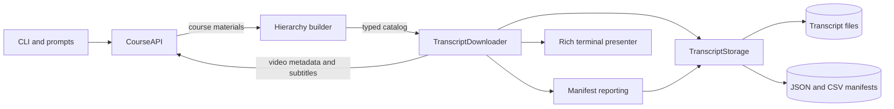

# Coursera Transcript Generator

[](https://github.com/yaminsadik/coursera-transcript-generator/actions/workflows/test.yml)
[](https://www.python.org/downloads/)
[](LICENSE)

A terminal application for downloading the transcripts of Coursera courses you
are enrolled in. It preserves the course hierarchy, gives every video a stable
filename, and produces JSON and CSV manifests that explain exactly what was
downloaded, skipped, failed, or preserved from an earlier run.

> [!IMPORTANT]
> This is an independent community project and is not affiliated with or
> endorsed by Coursera. Use it only for courses you are authorized to access,
> and follow Coursera's terms and the course's copyright restrictions.


## Why use it?

- Downloads all available lecture transcripts in one run.
- Reconstructs `course → module → lesson → video` relationships.
- Supports plain-text transcripts and SRT subtitles.
- Preserves module, lesson, and video order in the output paths.
- Records names, IDs, slugs, positions, language, format, status, and errors.
- Keeps language/format outputs independent, so TXT and SRT can coexist.
- Writes partial manifests when interrupted.
- Preserves the last successful file when a refresh fails.
- Archives stale managed files instead of permanently deleting them.

## Quick start

Python 3.10 or newer is required.

```bash
git clone https://github.com/yaminsadik/coursera-transcript-generator.git
cd coursera-transcript-generator
python -m venv .venv
source .venv/bin/activate
python -m pip install -e .
coursera-transcripts
```

The interactive flow securely prompts for your authentication cookie, course
slug, language, format, and output directory.

For automation, pass the non-secret options as arguments and supply the cookie
through the environment:

```bash
export COURSERA_CAUTH="YOUR_CAUTH_VALUE"

coursera-transcripts \
  --slug machine-learning \
  --language en \
  --format txt \
  --output ./output
```

You can also run the package without installing its console script:

```bash
python -m coursera_transcripts --slug machine-learning
```

### Command options

| Option | Short | Default | Purpose |
| --- | --- | --- | --- |
| `--cookie` | `-c` | environment or prompt | Coursera CAUTH value; avoid this option on shared systems |
| `--slug` | `-s` | prompt | Course URL slug |
| `--language` | `-l` | `en` | Requested subtitle language code |
| `--format` |  | `txt` | `txt` or `srt` |
| `--output` | `-o` | `./output` | Parent output directory |

## Authentication

1. Sign in at [coursera.org](https://www.coursera.org).
2. Open browser developer tools.
3. Open **Application → Cookies → https://www.coursera.org**.
4. Copy the value of the `CAUTH` cookie.
5. Paste it into the hidden interactive prompt, or set `COURSERA_CAUTH`.

Do not commit the cookie, put it in a checked-in configuration file, or pass it
on a command line that other users can inspect. Authentication cookies are sent
only to Coursera hosts; signed external subtitle URLs are fetched without the
cookie.

## Output and reports

```text
output/
└── machine-learning/
    ├── manifest.json                  # latest run
    ├── manifest.csv
    ├── manifest.en.txt.json           # latest English TXT run
    ├── manifest.en.txt.csv
    ├── 01-Introduction to ML/
    │   └── 01-Getting Started/
    │       ├── 001-Welcome--abc123.en.txt
    │       └── 002-Course Overview--def456.en.txt
    └── .stale/
        └── 20260730T183000000000Z/    # recoverable files from older layouts
```

Transcript bodies are saved unchanged as UTF-8. Metadata lives in the
manifests, keeping the transcript files clean and easy to process.

Each manifest row contains:

| Category | Fields |
| --- | --- |
| Course | name, slug |
| Module | ID, name, slug, position |
| Lesson | ID, name, slug, position |
| Video | ID, name, slug, position, content type, duration |
| Access | optional and locked flags |
| Artifact | language, format, current path, preserved previous path |
| Result | downloaded, skipped, failed, or interrupted status and error |

Unqualified manifests describe the latest run. Scoped manifests such as
`manifest.en.txt.json` keep each language and format independent. If a complete
rerun moves or removes a managed transcript, the old file is moved into a
timestamped `.stale/` directory. If a refresh fails, the prior successful file
stays in place and appears as `previous_path` in the new manifest.

## Architecture

The application keeps Coursera transport, hierarchy reconstruction, download
orchestration, reporting, presentation, and filesystem behavior separate.



See [Architecture](docs/architecture.md) for component responsibilities,
sequence diagrams, data models, persistence rules, and extension guidance.

## Reliability behavior

- API requests use bounded retries for timeouts, rate limits, and server errors.
- Empty responses, HTML login pages, and malformed SRT content are rejected.
- Transcript and manifest writes are atomic.
- One lecture failure does not abort the remaining course.
- Ctrl+C writes a complete partial report before exiting.
- Paths are sanitized, length-bounded, and checked against the output root.
- Stale-file reconciliation is scoped to the same language and format.

## Development

```bash
python -m pip install -e ".[dev]"
ruff check src tests
ruff format --check src tests
python -m unittest discover -s tests -v
python -m build
```

The test suite uses mocked Coursera responses and does not require a real
account. Live evaluation is still recommended when Coursera changes its private
API response shape.

See [Contributing](CONTRIBUTING.md), [Security](SECURITY.md), and the
[Changelog](CHANGELOG.md) for project policies and release history.

## License

Released under the [MIT License](LICENSE).
