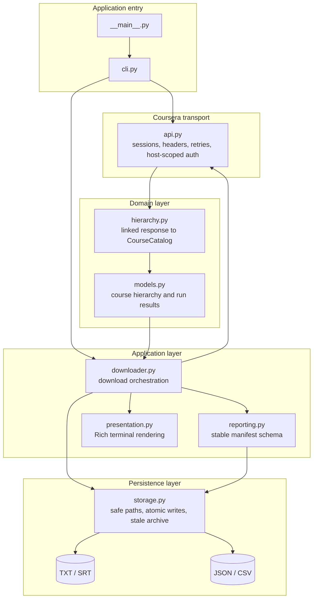
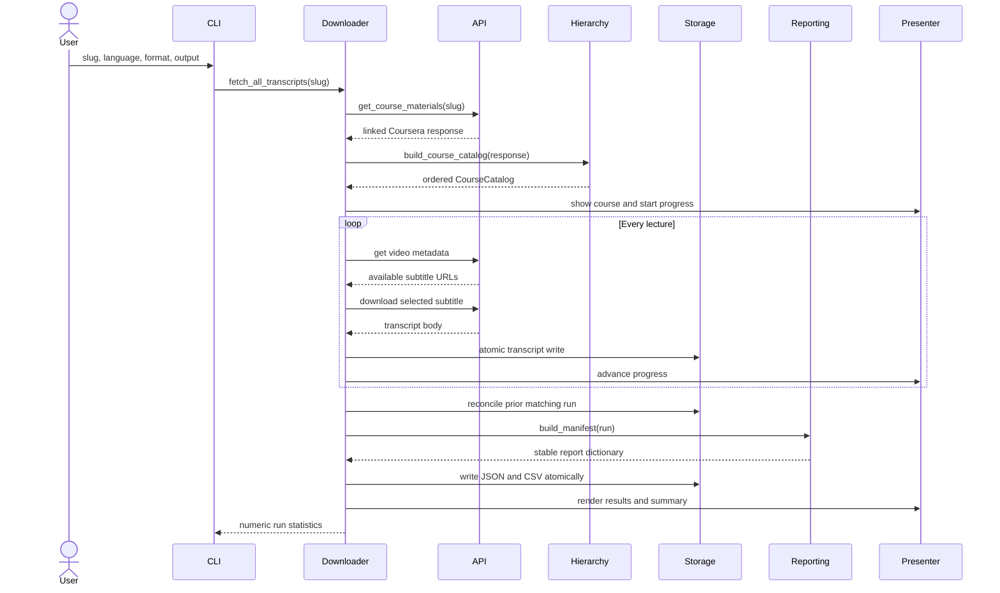
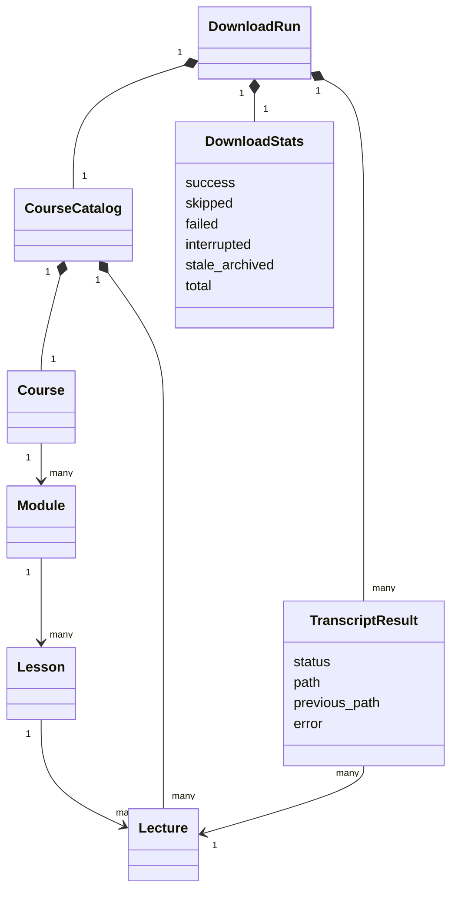

# Architecture

Coursera Transcript Generator is organized as a small pipeline with explicit
boundaries between network access, domain mapping, orchestration, presentation,
report generation, and persistence. The boundaries make private API changes
and new output formats easier to isolate and test.

## Component map

## Responsibilities

| Module | Owns | Does not own |
| --- | --- | --- |
| `cli.py` | argument parsing, interactive prompts, process exit codes | download rules or file layout |
| `api.py` | HTTP sessions, retries, Coursera request construction, cookie scoping | course hierarchy or filenames |
| `hierarchy.py` | conversion of linked API resources into ordered domain objects | HTTP or persistence |
| `models.py` | immutable course structures and typed run/result state | serialization or terminal output |
| `downloader.py` | application workflow and per-lecture decisions | Rich layout or manifest field definitions |
| `reporting.py` | manifest schema and domain-to-record conversion | writing files |
| `presentation.py` | progress bars, result trees, and summaries | domain decisions |
| `storage.py` | sanitized paths, atomic writes, scoped manifests, stale archives | network access or terminal rendering |

## Download sequence

## Domain model

Coursera returns resources in linked collections. `hierarchy.py` resolves these
relationships by following module lesson IDs, lesson element IDs, passable item
groups, and group choices. Items that cannot be placed safely remain visible in
explicit `Unassigned module` and `Unassigned lesson` directories.

## Persistence lifecycle

Each language/format pair is an independent managed set. For English plain text,
the authoritative scoped files are `manifest.en.txt.json` and
`manifest.en.txt.csv`. `manifest.json` and `manifest.csv` are convenient copies
of the most recent run of any type.

On a successful run:

1. Transcript bodies are validated and written through an atomic temporary file.
2. The new typed results are compared with the prior scoped manifest.
3. A prior file is preserved when the current refresh fails or is skipped.
4. A prior file whose video disappeared or whose managed path changed is moved
   into a timestamped `.stale/` tree.
5. JSON and CSV manifests are generated from the same schema and written
   atomically.

On interruption, remaining lectures receive an `interrupted` result, partial
manifests are written, stale reconciliation is skipped, and the interrupt is
propagated to the CLI for exit code 130.

## Security boundaries

- The CAUTH cookie is attached only to `coursera.org` and its subdomains.
- External signed subtitle hosts receive no Coursera cookie.
- User- and API-provided path components are sanitized and length bounded.
- Every resolved output path is checked to remain under the configured root.
- Stale files are archived instead of deleted.
- The CLI's interactive cookie prompt is hidden; environment configuration is
  preferred for automation.

## Extending the project

To add a transcript format, update subtitle selection and validation in the
application layer, add the format to storage validation and CLI choices, then
add an end-to-end mocked test. Keep format-specific parsing out of the API and
storage layers.

To add another course provider, implement a provider-specific API client,
hierarchy adapter, and thin orchestration service that produce the existing run
models. Reporting, presentation, and storage can then be reused without knowing
the provider's response shape.

To add another report format, serialize `DownloadRun` in `reporting.py` and let
`storage.py` own the physical write. Avoid placing terminal or filesystem logic
inside the domain models.
